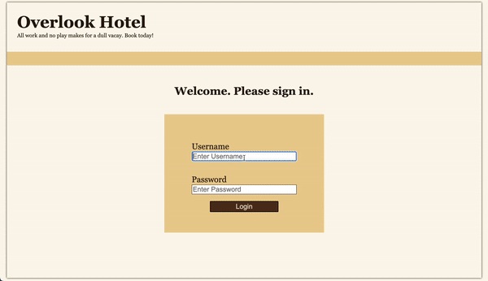

# Overlook Hotel

## Abstract

Overlook Hotel is an app mimicking a hotel website. As a user, you will first see a login screen. Upon entering the proper credentials, you will see your dashboard showing your current bookings and the total amount spent on rooms. The user can search for more rooms to book based on date and optional room type. The users, rooms, and bookings all utilize GET requests to a local API, and a POST request to bookings when a user books a room.
***

### Technologies Used:
- JavaScript
- HTML
- CSS
- WAVE/Lighthouse
- Webpack
- Mocha
- Chai
***

### Installation Instructions:

To clone a copy of the project to a remote repository, follow these steps:

1. Clone down a local copy of [the repository](https://github.com/kirkhauck/overlook-hotel).
1. `cd` into the repository and run `npm install`
1. Clone down a local copy of [the API](https://github.com/turingschool-examples/overlook-api).
1. `cd` into the repository and run `npm install`
1. You can open the project in your preferred text editor.
1. To host the page on your local server run first run `npm start` in the API repo and again in the project repo.
***

### Preview of App:

***

### Context:

Completed as part of the Turing School of Software Development 2211 FE Mod 2 curriculum

Approximate hours to completion: 16
***

### Contributors:
[Kirk Hauck](https://github.com/kirkhauck)
***

### Learning Goals:

Use OOP to drive the design of the application and the code
Work with an API to send and receive data
Solidify the code review process
Create a robust test suite that thoroughly tests all functionality of a client-side application
***

### Wins + Challenges:

**Win:**

Created an app from the ground up with no provided instructions as to what classes or methods should be used.

**Win:**

Successfully utilized GET and POST to use data from a local API.

**Challenge:**

Using `event.preventDefault()` with a button to submit a form with required fields. This method would prevent the notification from popping up telling the user to fill out a field. Learned how to listen form a `submit` event instead, which worked with `event.preventDefault()` to prevent page reloading while still allowing notifications for required fields.

**Challenge:**

Planning a project without guidance as to classes or what class methods should be used. At first, planning and implementing features was chaotic. After research and seeking advice from peers, a new method was adopted where all functionality relating to DOM manipulation would be kept in `scripts.js` and all methods interacting with objects and data would be implemented as class methods. Using this process, the project was more organized and it became clear when and how to use classes.